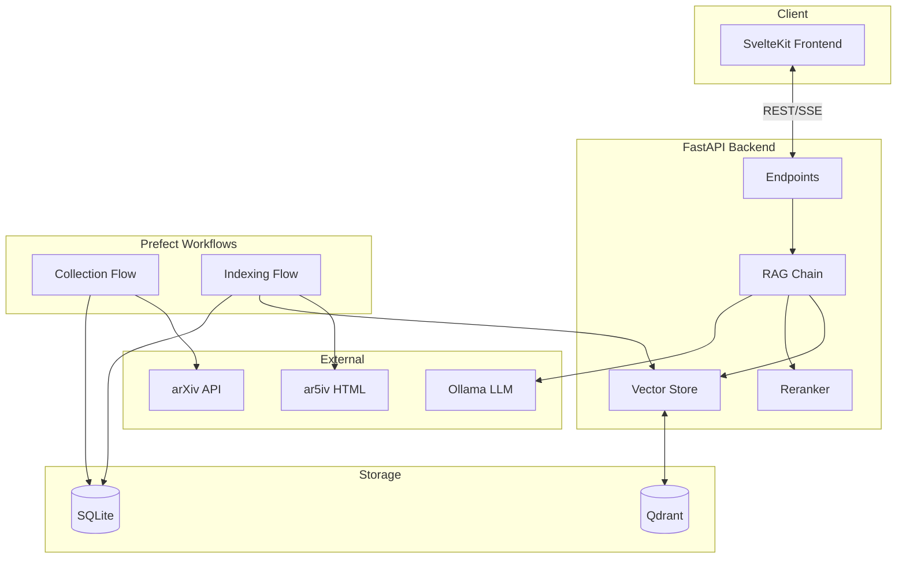
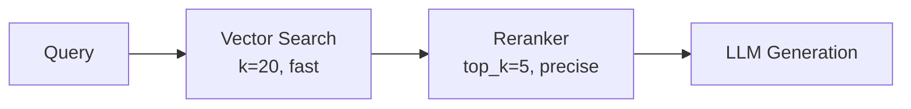
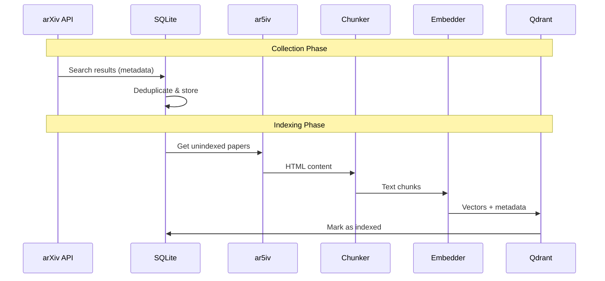
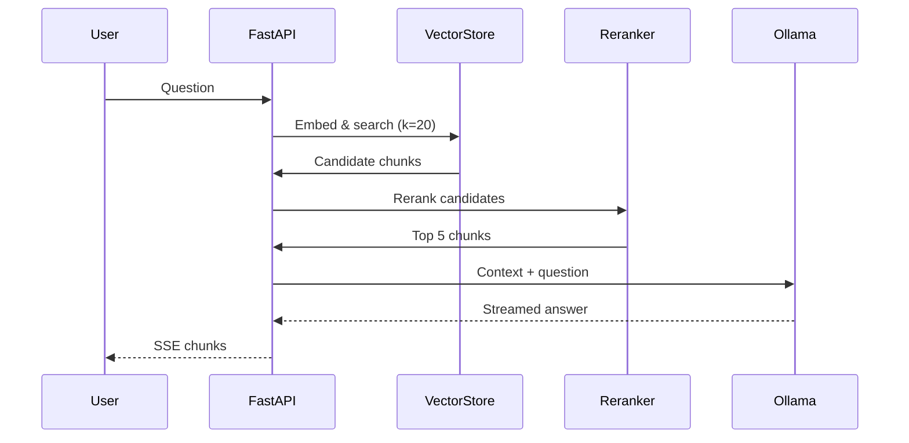

# Architecture Overview

This document explains the system architecture, design decisions, and how components interact.

## System Diagram



## Component Responsibilities

### API Layer (`src/main.py`)

| Endpoint | Method | Purpose |
|----------|--------|---------|
| `/query` | POST | RAG query with sources |
| `/query/stream` | POST | Streaming response via SSE |
| `/search` | POST | Vector search only (no LLM) |
| `/index` | POST | Manual paper indexing |
| `/models` | GET | List available LLM models |
| `/stats` | GET | Vector store statistics |
| `/health` | GET | Health check |

### Services Layer (`src/services/`)

```
services/
├── embeddings.py      # Embedding model abstraction
├── vector_store.py    # Qdrant client wrapper
├── reranker.py        # Cross-encoder reranking
├── rag_chain.py       # RAG orchestration
├── document_loader.py # PDF/HTML → chunks
├── html_fetcher.py    # ar5iv HTML parsing
└── arxiv_fetcher.py   # arXiv API client
```

### Workflow Layer (`src/workflows/`)

Prefect flows for automated paper collection and indexing:

- **Collection Flow**: Search arXiv → deduplicate → save to SQLite
- **Indexing Flow**: Fetch HTML → chunk → embed → store in Qdrant
- **Orchestrator**: Combines collection + indexing

## Design Decisions

### Why ar5iv HTML over PDFs?

| Aspect | PDF | ar5iv HTML |
|--------|-----|------------|
| Text extraction | Noisy, layout issues | Clean, structured |
| Section boundaries | Hard to detect | Explicit `<section>` tags |
| Math rendering | Often corrupted | Proper LaTeX |
| Availability | All papers | ~80% of papers |

**Decision**: Use ar5iv as primary source, fall back gracefully when unavailable.

### Why Qdrant over alternatives?

| Database | Pros | Cons |
|----------|------|------|
| **Qdrant** | Fast, filtering, easy setup | Less ecosystem |
| ChromaDB | Simple, embedded | Performance at scale |
| Pinecone | Managed, scalable | Cost, vendor lock-in |
| Weaviate | Feature-rich | Complex setup |

**Decision**: Qdrant provides the best balance of performance, features, and simplicity for a self-hosted solution.

### Why Two-Stage Retrieval?



1. **Stage 1 - Vector Search**: Fast approximate search over entire corpus (k=20)
2. **Stage 2 - Cross-Encoder**: Precise reranking of candidates (top_k=5)

This approach gets the best of both worlds:
- Speed of embedding-based search
- Precision of cross-encoder scoring

### Why Sentence Transformers over OpenAI?

| Aspect | Sentence Transformers | OpenAI Embeddings |
|--------|----------------------|-------------------|
| Cost | Free (local) | $0.0001/1K tokens |
| Latency | ~10ms | ~100-500ms |
| Privacy | Data stays local | Sent to API |
| Customization | Many models | Limited options |

**Decision**: Local embeddings for cost, speed, and privacy. OpenAI can be added as an option later.

## Data Flow

### Ingestion Pipeline



### Query Pipeline



## Scalability Considerations

### Current Limitations

- Single-node Qdrant (can be clustered)
- Synchronous embedding (can be batched)
- No caching layer (Redis can be added)

### Scaling Path

1. **More papers**: Qdrant handles millions of vectors
2. **More users**: Add Redis caching, load balancing
3. **Better quality**: Upgrade embedding model, add hybrid search
4. **Production**: Kubernetes deployment, monitoring
