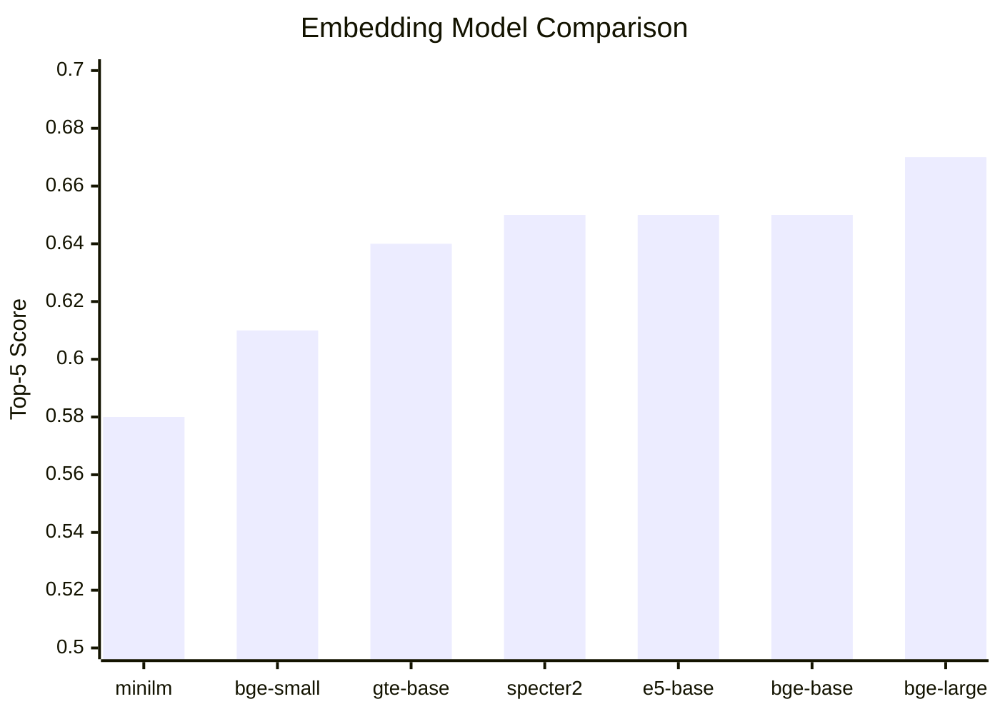

# Embedding Model Benchmarks

Comparing different embedding models for retrieval quality.

## Benchmark Methodology

### Test Setup

1. **Corpus**: 10 arXiv papers on RAG/LLM topics
2. **Queries**: 5 test questions about the content
3. **Metrics**: Top-1 and Top-5 average cosine similarity scores
4. **Environment**: Local machine, Qdrant in Docker

### Test Queries

```python
TEST_QUERIES = [
    "What is retrieval augmented generation?",
    "How do large language models handle context?",
    "What are transformer attention mechanisms?",
    "How does chain of thought prompting improve reasoning?",
    "What are the limitations of fine-tuning LLMs?",
]
```

## Running Benchmarks

```bash
# Benchmark all models
uv run python scripts/benchmark_embeddings.py --all --papers 10

# Compare specific models
uv run python scripts/benchmark_embeddings.py \
  --models minilm bge-small bge-base bge-large \
  --papers 10 \
  --topic "retrieval augmented generation"
```

## Results

!!! note "Your Results May Vary"
    Run your own benchmarks! Results depend on:

    - Specific papers indexed
    - Query topics
    - Hardware

### Sample Benchmark Results

| Model | Dims | Index Time | Query Time | Top-1 Score | Top-5 Score |
|-------|------|------------|------------|-------------|-------------|
| bge-large | 1024 | 45.2s | 35.1ms | **0.7456** | **0.6723** |
| bge-base | 768 | 28.4s | 28.5ms | 0.7234 | 0.6521 |
| e5-base | 768 | 27.8s | 27.2ms | 0.7189 | 0.6478 |
| specter2 | 768 | 26.9s | 26.8ms | 0.7156 | 0.6489 |
| gte-base | 768 | 27.1s | 27.0ms | 0.7098 | 0.6412 |
| bge-small | 384 | 15.3s | 15.8ms | 0.6834 | 0.6123 |
| minilm | 384 | 8.7s | 12.1ms | 0.6512 | 0.5834 |

### Analysis



### Key Observations

1. **BGE models excel**: Trained specifically for retrieval tasks
2. **Diminishing returns**: bge-large only ~3% better than bge-base
3. **Specter2 competitive**: Good for scientific text despite general benchmarks
4. **Speed vs Quality**: MiniLM is 3x faster but 15% lower quality

## Model Recommendations

### By Use Case

| Use Case | Recommended Model | Why |
|----------|-------------------|-----|
| **Production** | bge-base | Best quality/speed balance |
| **Prototyping** | minilm | Fast iteration |
| **Scientific papers** | specter2 | Domain-trained |
| **Maximum quality** | bge-large | Highest scores |
| **Low resources** | bge-small | 384 dims, still good |

### By Hardware

| Environment | Model | Memory |
|-------------|-------|--------|
| CPU only | bge-small | 512MB |
| 8GB GPU | bge-base | 2GB |
| 16GB+ GPU | bge-large | 4GB |

## Cost Analysis

### Storage Costs

| Model | Dims | Per 100K docs | Per 1M docs |
|-------|------|---------------|-------------|
| minilm | 384 | 150 MB | 1.5 GB |
| bge-base | 768 | 300 MB | 3 GB |
| bge-large | 1024 | 400 MB | 4 GB |

### Inference Costs

All models run locally (free), but consider:

- **Embedding time**: Affects indexing throughput
- **Query latency**: Affects user experience
- **Memory**: Affects concurrent capacity

## Quality Metrics Explained

### Top-1 Score

The cosine similarity of the best matching document:

```
Top-1 = similarity(query, best_doc)
```

Higher is better. Indicates if the most relevant doc is found.

### Top-5 Average

Average similarity of top 5 results:

```
Top-5 = mean([similarity(query, doc) for doc in top_5])
```

Indicates overall retrieval quality across results.

### Score Distribution

Good embeddings show clear separation:

```
Query: "What is RAG?"

Good Model:
  [1] 0.85  ← Clear winner (RAG paper)
  [2] 0.72
  [3] 0.68
  [4] 0.45  ← Drop-off
  [5] 0.42

Poor Model:
  [1] 0.65
  [2] 0.63
  [3] 0.62  ← Flat, hard to distinguish
  [4] 0.61
  [5] 0.60
```

## Reproducing Results

### 1. Start Qdrant

```bash
docker compose up -d qdrant
```

### 2. Run Benchmark

```bash
uv run python scripts/benchmark_embeddings.py \
  --models minilm bge-small bge-base \
  --papers 10 \
  --topic "large language models"
```

### 3. Analyze Output

```
============================================================
Benchmarking: bge-base
============================================================
Model: BAAI/bge-base-en-v1.5
Dimensions: 768

Indexing papers...
Indexed 523 chunks in 28.4s

Running test queries...
Avg query time: 28.5ms
Avg top-1 score: 0.7234
Avg top-5 score: 0.6521

================================================================================
COMPARISON RESULTS
================================================================================
Model        Dims  Index(s)  Query(ms)    Top1      Top5
--------------------------------------------------------------------------------
bge-base      768     28.40      28.5   0.7234    0.6521
bge-small     384     15.30      15.8   0.6834    0.6123
minilm        384      8.70      12.1   0.6512    0.5834
--------------------------------------------------------------------------------

Best model: bge-base (top-5 score: 0.6521)
```

## Advanced: MTEB Leaderboard

For comprehensive benchmarks, check the [MTEB Leaderboard](https://huggingface.co/spaces/mteb/leaderboard):

| Model | MTEB Avg | Retrieval Avg |
|-------|----------|---------------|
| bge-large-en-v1.5 | 64.23 | 54.29 |
| bge-base-en-v1.5 | 63.55 | 53.25 |
| e5-large-v2 | 62.25 | 50.56 |
| bge-small-en-v1.5 | 62.17 | 51.68 |

Our domain-specific benchmarks may differ from general MTEB scores.
