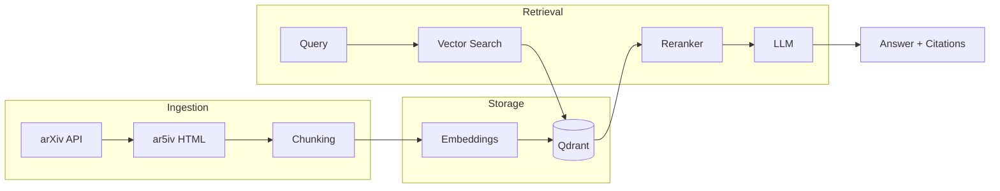

# Research Assistant

A **RAG (Retrieval-Augmented Generation)** system for exploring academic papers from arXiv. Built to quickly find and query specific papers across the vast AI literature—helping keep track of the fast-moving state of the art.

## Highlights

| | Feature | Description |
|---|---------|-------------|
| :material-file-document-multiple: | **Paper Ingestion** | Automated collection from arXiv with HTML parsing for better text extraction |
| :material-vector-combine: | **Vector Search** | Semantic search with configurable embedding models and Qdrant vector database |
| :material-sort-variant: | **Two-Stage Retrieval** | Cross-encoder reranking for precision on top of fast vector search |
| :material-api: | **Production API** | FastAPI backend with streaming responses and SvelteKit frontend |

## Key Features

- **Automated Paper Collection**: Fetch papers from arXiv using configurable search queries
- **Smart Text Extraction**: Use ar5iv HTML for cleaner text than raw PDFs
- **Configurable Embeddings**: Swap embedding models without code changes
- **Two-Stage Retrieval**: Vector search + cross-encoder reranking
- **Streaming Responses**: Real-time answer generation with SSE
- **Modern Frontend**: SvelteKit UI with dark mode and citation support

## Quick Start

```bash
# Clone and install
git clone https://github.com/agapestack/research-assistant
cd research-assistant
uv sync

# Start Qdrant
docker compose up -d qdrant

# Index some papers
uv run python scripts/benchmark_embeddings.py --models bge-base --papers 10

# Start the API
uv run uvicorn src.main:app --reload

# Start the frontend (separate terminal)
cd frontend && npm install && npm run dev
```

## Architecture Overview



## Project Goals

This project was built to demonstrate:

1. **End-to-end RAG implementation** from data ingestion to user interface
2. **Production-quality code** with proper architecture and testing
3. **Engineering decision-making** with documented trade-offs
4. **Benchmarking methodology** for comparing embedding models
5. **Modern Python tooling** (uv, FastAPI, Pydantic, type hints)

## What You'll Learn

Explore the documentation to understand:

- [How papers are ingested and processed](pipeline/ingestion.md)
- [Chunking strategies for academic text](pipeline/chunking.md)
- [Comparing embedding models](benchmarks/embeddings.md)
- [Two-stage retrieval with reranking](pipeline/retrieval.md)
- [System architecture decisions](architecture/overview.md)
