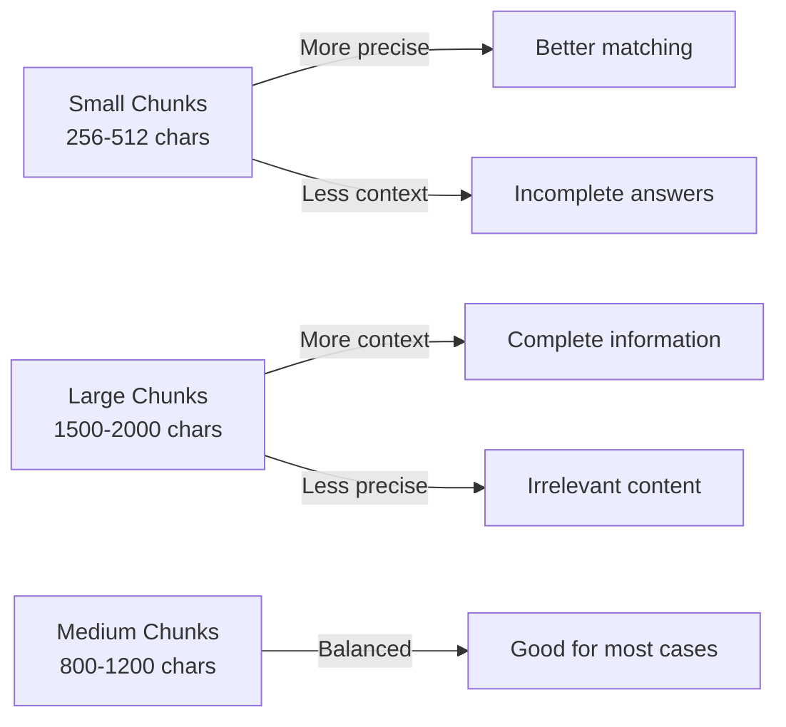

# Chunking Strategy

How documents are split into chunks for effective retrieval.

## Why Chunking Matters

LLMs have context limits, and embedding models work best on focused text segments. Chunking determines:

- **Retrieval precision**: Smaller chunks = more precise matches
- **Context completeness**: Larger chunks = more context per result
- **Storage efficiency**: Chunk size affects vector count

## The Trade-off



## Our Configuration

```python
from langchain_text_splitters import RecursiveCharacterTextSplitter

splitter = RecursiveCharacterTextSplitter(
    chunk_size=1000,
    chunk_overlap=200,
    separators=["\n\n", "\n", ". ", " ", ""]
)
```

### Parameters Explained

| Parameter | Value | Reasoning |
|-----------|-------|-----------|
| `chunk_size` | 1000 | ~150-200 tokens, fits in context |
| `chunk_overlap` | 200 | Preserves context at boundaries |
| `separators` | Hierarchical | Respects document structure |

### Separator Hierarchy

The splitter tries separators in order:

1. `\n\n` - Paragraph breaks (best)
2. `\n` - Line breaks
3. `. ` - Sentence boundaries
4. ` ` - Word boundaries
5. `` - Character level (last resort)

## Implementation

```python
def chunk_document(
    pages: list[dict],
    source: str,
    chunk_size: int = 1000,
    chunk_overlap: int = 200,
    extra_metadata: dict | None = None,
) -> list[Document]:
    splitter = RecursiveCharacterTextSplitter(
        chunk_size=chunk_size,
        chunk_overlap=chunk_overlap,
        separators=["\n\n", "\n", ". ", " ", ""],
    )

    documents = []
    for page_data in pages:
        chunks = splitter.split_text(page_data["text"])
        for i, chunk in enumerate(chunks):
            metadata = {
                "source": source,
                "page": page_data["page"],  # Section number for HTML
                "chunk": i,
            }
            if extra_metadata:
                metadata.update(extra_metadata)
            documents.append(Document(page_content=chunk, metadata=metadata))

    return documents
```

## Metadata Preservation

Each chunk carries metadata for citation:

```python
{
    "source": "ar5iv:2401.12345",
    "page": 3,  # Section index
    "chunk": 0,  # Chunk within section
    "title": "Attention Is All You Need",
    "authors": "Vaswani et al.",
    "arxiv_url": "https://arxiv.org/abs/2401.12345",
    "arxiv_id": "2401.12345",
    "published": "2024-01-15T00:00:00",
}
```

## Section-Aware Chunking

For ar5iv HTML, we treat each section as a "page":

```python
def extract_text_from_html(paper_html: PaperHTML) -> list[dict]:
    pages = []

    # Abstract as page 0
    if paper_html.abstract:
        pages.append({"text": f"Abstract\n\n{paper_html.abstract}", "page": 0})

    # Each section as a page
    for i, section in enumerate(paper_html.sections, start=1):
        text = f"{section.title}\n\n{section.content}"
        pages.append({"text": text, "page": i})

    return pages
```

This preserves document structure and enables section-level filtering.

## Chunk Size Analysis

### Academic Paper Statistics

Typical paper after chunking:

| Paper Length | Sections | Chunks (1000 char) |
|--------------|----------|-------------------|
| Short (4 pages) | 5-6 | 20-30 |
| Medium (8 pages) | 8-10 | 40-60 |
| Long (15+ pages) | 12-15 | 80-120 |

### Storage Impact

```
Storage per chunk ≈ 2 KB
  - Vector (768 dims): 768 × 4 bytes = 3 KB
  - Metadata: ~500 bytes
  - Content: ~1 KB

1000 papers × 50 chunks × 2 KB = 100 MB
```

## Alternative Strategies

### Semantic Chunking

Split by meaning rather than character count:

```python
# Not implemented, but possible approach
from langchain_experimental.text_splitter import SemanticChunker

chunker = SemanticChunker(
    embeddings=embeddings,
    breakpoint_threshold_type="percentile"
)
```

**Pros**: Better semantic boundaries
**Cons**: Slower, inconsistent chunk sizes

### Sentence-Level Chunking

```python
import nltk
sentences = nltk.sent_tokenize(text)
# Group sentences into ~1000 char chunks
```

**Pros**: Clean boundaries
**Cons**: May split related content

### Sliding Window

```python
# Fixed window with overlap
window_size = 1000
step = 800  # 200 char overlap

chunks = [text[i:i+window_size] for i in range(0, len(text), step)]
```

**Pros**: Simple, predictable
**Cons**: Ignores structure

## Recommendations by Use Case

| Use Case | Chunk Size | Overlap | Notes |
|----------|-----------|---------|-------|
| Q&A | 800-1000 | 200 | Balance precision/context |
| Summarization | 1500-2000 | 300 | More context needed |
| Semantic Search | 500-800 | 100 | Precision matters |
| Chat/Conversation | 1000-1200 | 200 | Good for follow-ups |

## Experimentation

You can experiment with different settings:

```python
# In document_loader.py or via API
docs = load_paper_from_html(
    arxiv_id="2401.12345",
    metadata={...},
    chunk_size=800,    # Try different values
    chunk_overlap=150,
)
```

Monitor retrieval quality with:

```bash
uv run python scripts/evaluate_retrieval.py --compare
```
