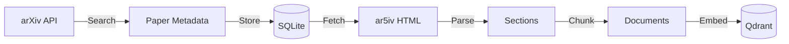

# Paper Ingestion Pipeline

How academic papers are collected from arXiv and prepared for indexing.

## Overview



## Step 1: Searching arXiv

The arXiv API allows searching by title, abstract, author, and category.

### Search Queries

```python
SEARCH_QUERIES = [
    'ti:"large language model" OR abs:"large language model"',
    'ti:"retrieval augmented generation" OR abs:"retrieval augmented generation"',
    'ti:transformer OR abs:transformer',
    'ti:RAG OR abs:RAG',
]
```

### Category Filtering

We focus on AI/ML papers:

```python
CS_CATEGORIES = {"cs.AI", "cs.CL", "cs.LG", "cs.IR", "cs.NE"}
```

- `cs.AI` - Artificial Intelligence
- `cs.CL` - Computation and Language (NLP)
- `cs.LG` - Machine Learning
- `cs.IR` - Information Retrieval
- `cs.NE` - Neural and Evolutionary Computing

### API Implementation

```python
import arxiv

client = arxiv.Client(page_size=100, delay_seconds=3, num_retries=3)
search = arxiv.Search(
    query=query,
    max_results=100,
    sort_by=arxiv.SortCriterion.SubmittedDate,
    sort_order=arxiv.SortOrder.Descending,
)

for paper in client.results(search):
    # Extract metadata
    paper_data = {
        "arxiv_id": paper.get_short_id(),  # e.g., "2401.12345"
        "title": paper.title,
        "authors": [a.name for a in paper.authors],
        "abstract": paper.summary,
        "published": paper.published.isoformat(),
        "categories": paper.categories,
        "arxiv_url": paper.entry_id,
    }
```

### Rate Limiting

arXiv has strict rate limits:

- 3 second delay between requests
- Automatic retries on failure
- Respectful crawling

## Step 2: Storing Metadata

Papers are stored in SQLite for tracking:

```sql
CREATE TABLE papers (
    arxiv_id TEXT PRIMARY KEY,
    title TEXT,
    authors TEXT,
    abstract TEXT,
    published TEXT,
    categories TEXT,
    arxiv_url TEXT,
    collected_at TEXT,
    is_indexed INTEGER DEFAULT 0,
    html_available INTEGER DEFAULT NULL
);
```

### Deduplication

Papers may appear in multiple search queries. We deduplicate by `arxiv_id`:

```python
def deduplicate_papers(all_papers: list[list[dict]]) -> list[dict]:
    seen = set()
    unique = []
    for papers in all_papers:
        for paper in papers:
            if paper["arxiv_id"] not in seen:
                seen.add(paper["arxiv_id"])
                unique.append(paper)
    return unique
```

## Step 3: Fetching HTML Content

### Why ar5iv over PDFs?

| Aspect | PDF | ar5iv HTML |
|--------|-----|------------|
| Text quality | Often corrupted | Clean |
| Structure | Lost | Preserved |
| Math | Garbled | LaTeX |
| Tables | Broken | Intact |

ar5iv is a project that renders arXiv papers as HTML, preserving structure.

### HTML Fetching

```python
from dataclasses import dataclass
from bs4 import BeautifulSoup
import httpx

@dataclass
class PaperHTML:
    arxiv_id: str
    title: str | None
    abstract: str | None
    sections: list[Section]
    success: bool
    error: str | None = None

def fetch_paper_html(arxiv_id: str) -> PaperHTML:
    url = f"https://ar5iv.labs.arxiv.org/html/{arxiv_id}"
    response = httpx.get(url, timeout=30, follow_redirects=True)

    if response.status_code != 200:
        return PaperHTML(arxiv_id=arxiv_id, success=False, error="Not found")

    soup = BeautifulSoup(response.text, "html.parser")
    # Extract title, abstract, sections...
```

### Section Extraction

```python
@dataclass
class Section:
    title: str
    content: str

def extract_sections(soup: BeautifulSoup) -> list[Section]:
    sections = []
    for section in soup.find_all("section"):
        title = section.find(["h2", "h3", "h4"])
        title_text = title.get_text(strip=True) if title else "Untitled"

        # Get text content, excluding nested sections
        content = section.get_text(separator="\n", strip=True)
        sections.append(Section(title=title_text, content=content))

    return sections
```

### Handling Unavailable Papers

Not all papers have ar5iv HTML (~80% coverage):

```python
def fetch_and_chunk_paper(paper: dict) -> dict:
    paper_html = fetch_paper_html(paper["arxiv_id"])

    if not paper_html.success:
        # Mark as unavailable, don't retry
        return {"status": "no_html", "chunks": 0}

    # Continue with chunking...
```

## Step 4: Running the Pipeline

### Manual Indexing (API)

```bash
curl -X POST http://localhost:8000/index \
  -H "Content-Type: application/json" \
  -d '{"topic": "retrieval augmented generation", "max_results": 10}'
```

### Automated Workflows (Prefect)

```bash
# Collect papers from arXiv
uv run python scripts/run_flow.py collect --days 30 --max-per-query 100

# Index collected papers
uv run python scripts/run_flow.py index --limit 50

# Or run both
uv run python scripts/run_flow.py full
```

### Benchmarking Script

```bash
# Quick test with specific topic
uv run python scripts/benchmark_embeddings.py \
  --models bge-base \
  --papers 10 \
  --topic "large language models"
```

## Pipeline Statistics

After running the collection pipeline:

```
Collection complete:
  - queries_run: 7
  - total_found: 2,847
  - unique_papers: 1,523
  - saved_to_db: 1,523

Indexing complete:
  - processed: 50
  - successful: 42
  - no_html: 8
  - total_chunks: 4,200
```

## Error Handling

### Retry Strategy

```python
@task(retries=3, retry_delay_seconds=30)
def search_arxiv(query: str, max_results: int):
    # Automatic retry on network failures
    ...
```

### Graceful Degradation

- If ar5iv unavailable → mark paper, don't retry
- If embedding fails → log error, continue with others
- If Qdrant down → fail fast, alert

## Best Practices

1. **Respect rate limits**: 3+ seconds between arXiv requests
2. **Batch operations**: Index in batches of 100 chunks
3. **Track state**: Use SQLite to avoid re-processing
4. **Monitor progress**: Prefect UI shows real-time status
