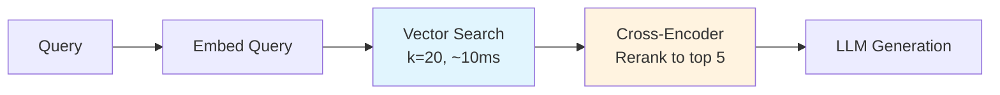
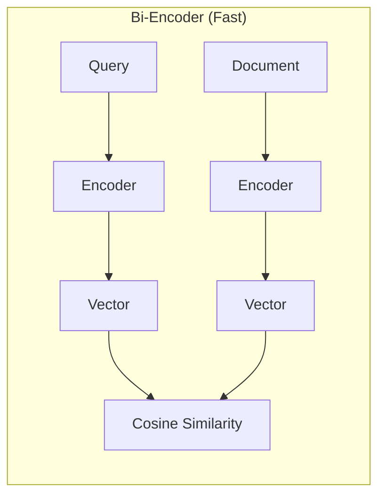
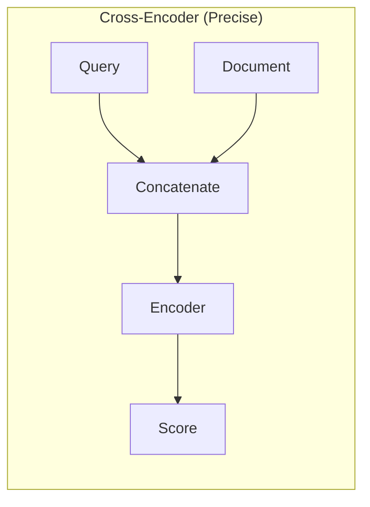

# Retrieval & Reranking

How we find and rank the most relevant documents for a query.

## Two-Stage Retrieval

We use a two-stage approach for optimal speed and precision:



### Why Two Stages?

| Approach | Speed | Precision | Use Case |
|----------|-------|-----------|----------|
| Vector only | ⚡⚡⚡ | Good | Large-scale filtering |
| Cross-encoder only | ⚡ | Excellent | Can't scale |
| **Two-stage** | ⚡⚡ | **Excellent** | **Best of both** |

## Stage 1: Vector Search

Fast approximate nearest neighbor search over the entire corpus.

### How It Works

```python
def _retrieve_and_rerank(self, question: str, k: int = 5) -> list[dict]:
    # Fetch more candidates than needed
    fetch_k = 20 if self.enable_reranking else k

    # Fast vector search
    results = self.vector_store.search(question, k=fetch_k)
    # ...
```

### Bi-Encoder Architecture



**Key Property**: Document vectors are pre-computed, only query needs encoding at search time.

### Performance

- **Indexing**: ~1ms per document (batched)
- **Search**: ~10-30ms for 100K vectors
- **Scales**: Millions of vectors with HNSW

## Stage 2: Cross-Encoder Reranking

Precise scoring of candidate documents.

### How It Works

```python
from sentence_transformers import CrossEncoder

class Reranker:
    def __init__(self, model_name: str = "BAAI/bge-reranker-base"):
        self.model = CrossEncoder(model_name, max_length=512)

    def rerank(
        self,
        query: str,
        documents: list[dict],
        top_k: int | None = None,
    ) -> list[dict]:
        # Create query-document pairs
        pairs = [(query, doc["content"]) for doc in documents]

        # Score all pairs
        scores = self.model.predict(pairs)

        # Add scores and sort
        for doc, score in zip(documents, scores):
            doc["rerank_score"] = float(score)
            doc["original_score"] = doc.get("score", 0.0)

        reranked = sorted(documents, key=lambda x: x["rerank_score"], reverse=True)

        return reranked[:top_k] if top_k else reranked
```

### Cross-Encoder Architecture



**Key Property**: Sees query and document together, enabling deeper understanding.

### Why Cross-Encoders Are Better

| Feature | Bi-Encoder | Cross-Encoder |
|---------|------------|---------------|
| Query-doc interaction | None (independent) | Full attention |
| Semantic matching | Surface level | Deep understanding |
| Negation handling | Poor | Good |
| Speed | Fast | Slow |

### Example Improvement

Query: *"Papers that do NOT use transformers"*

| Document | Bi-Encoder | Cross-Encoder |
|----------|------------|---------------|
| "We use BERT transformer..." | 0.82 ❌ | 0.15 ✅ |
| "Our CNN-based approach..." | 0.45 | 0.78 ✅ |

The bi-encoder matches "transformers" lexically; the cross-encoder understands negation.

## Configuration

### Parameters

```python
class RAGChain:
    def __init__(
        self,
        enable_reranking: bool = True,  # Toggle reranking
        retrieval_k: int = 20,          # Candidates from vector search
        rerank_top_k: int = 5,          # Final results after reranking
    ):
```

### Trade-offs

| retrieval_k | rerank_top_k | Speed | Quality |
|-------------|--------------|-------|---------|
| 10 | 3 | Fast | Lower recall |
| 20 | 5 | **Balanced** | **Good** |
| 50 | 10 | Slower | Better recall |
| 100 | 10 | Slow | Diminishing returns |

## Reranker Models

| Model | Size | Quality | Speed |
|-------|------|---------|-------|
| `bge-reranker-base` | 278M | Good | ~50ms/20 docs |
| `bge-reranker-large` | 560M | Better | ~100ms/20 docs |
| `bge-reranker-v2-m3` | 568M | Best | ~120ms/20 docs |

We use `bge-reranker-base` for good balance.

## Score Interpretation

### Before Reranking (Cosine Similarity)

```
Doc 1: 0.78  ← Similar embedding
Doc 2: 0.75
Doc 3: 0.72
Doc 4: 0.71  ← Hard to distinguish
Doc 5: 0.70
```

### After Reranking (Cross-Encoder)

```
Doc 3: 0.92  ← Actually most relevant!
Doc 1: 0.84
Doc 5: 0.67
Doc 2: 0.45  ← Reranker found it less relevant
Doc 4: 0.23
```

The reranker often reorders significantly, catching semantic nuances.

## Evaluation

Compare with and without reranking:

```bash
uv run python scripts/evaluate_retrieval.py --compare
```

Output:

```
============================================================
WITHOUT RERANKER
============================================================
Query: What is retrieval augmented generation?
  [1] A Survey on Retrieval-Augmented...
      Score: 0.7823
  [2] Dense Passage Retrieval...
      Score: 0.7654

============================================================
WITH RERANKER
============================================================
Query: What is retrieval augmented generation?
  [1] Retrieval-Augmented Generation for...  ← Different order!
      Score: 0.9234 (orig: 0.7234)
  [2] A Survey on Retrieval-Augmented...
      Score: 0.8912 (orig: 0.7823)
```

## Context Formatting

Retrieved documents are formatted for the LLM:

```python
def _format_context(self, results: list[dict]) -> str:
    context_parts = []
    for i, r in enumerate(results, 1):
        meta = r["metadata"]
        source_info = f"[{i}] {meta.get('title', 'Unknown')}"
        source_info += f"\n    URL: {meta.get('arxiv_url', '')}"
        source_info += f"\n    Authors: {meta.get('authors', 'Unknown')}"
        source_info += f"\n    Content: {r['content']}"
        context_parts.append(source_info)
    return "\n\n".join(context_parts)
```

Output:

```
[1] Attention Is All You Need
    URL: https://arxiv.org/abs/1706.03762
    Authors: Vaswani et al.
    Content: The dominant sequence transduction models...

[2] BERT: Pre-training of Deep Bidirectional...
    URL: https://arxiv.org/abs/1810.04805
    Authors: Devlin et al.
    Content: We introduce a new language representation...
```

## Future Improvements

### Hybrid Search

Combine BM25 (keyword) with semantic search:

```python
# Reciprocal Rank Fusion
def hybrid_search(query, alpha=0.5):
    semantic_results = vector_search(query)
    keyword_results = bm25_search(query)

    # Fuse rankings
    fused = reciprocal_rank_fusion(semantic_results, keyword_results, alpha)
    return fused
```

### Query Expansion

Generate related queries for better recall:

```python
# Use LLM to expand query
expanded = llm.generate(f"Generate 3 related search queries for: {query}")
# Search with all queries, deduplicate results
```

### Learned Sparse Retrieval

Models like SPLADE combine benefits of sparse and dense:

```python
# SPLADE produces sparse vectors with semantic understanding
from transformers import AutoModelForMaskedLM
model = AutoModelForMaskedLM.from_pretrained("naver/splade-cocondenser-ensembledistil")
```
