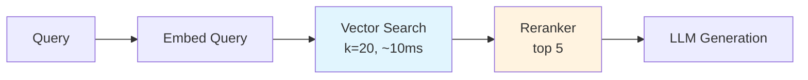
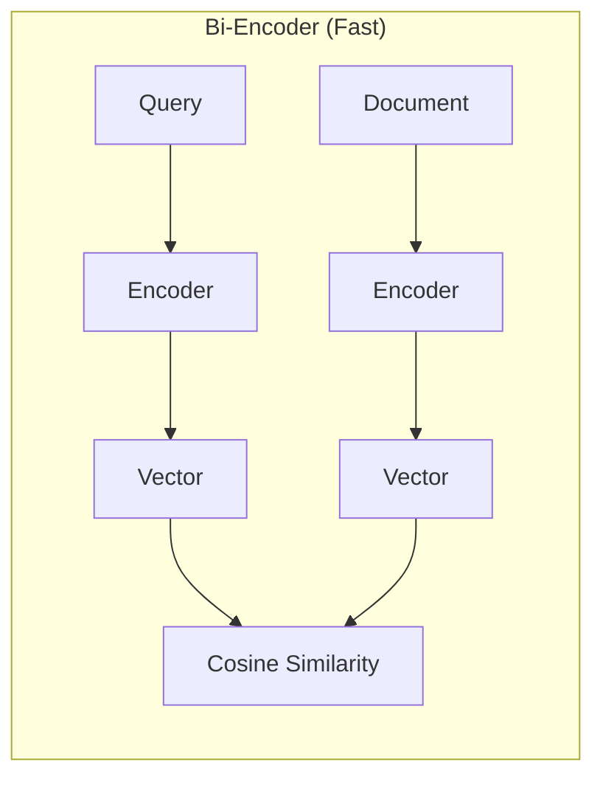

# Retrieval & Reranking

How we find and rank the most relevant documents for a query.

## Two-Stage Retrieval

We use a two-stage approach for optimal speed and precision:



### Why Two Stages?

| Approach | Speed | Precision | Use Case |
|----------|-------|-----------|----------|
| Vector only | Fast | Good | Large-scale filtering |
| Reranker only | Slow | Excellent | Can't scale |
| **Two-stage** | Balanced | **Excellent** | **Best of both** |

## Stage 1: Vector Search

Fast approximate nearest neighbor search over the entire corpus.

### How It Works

```python
def _retrieve_and_rerank(self, question: str, k: int = 5) -> list[dict]:
    # Fetch more candidates than needed
    fetch_k = 20 if self.enable_reranking else k

    # Fast vector search
    results = self.vector_store.search(question, k=fetch_k)
    # ...
```

### Bi-Encoder Architecture



**Key Property**: Document vectors are pre-computed, only query needs encoding at search time.

## Stage 2: Reranking with jina-reranker-v3

Precise scoring of candidate documents using [jina-reranker-v3](https://huggingface.co/jinaai/jina-reranker-v3).

### Why jina-reranker-v3?

Selected based on [MTEB Reranking leaderboard](https://huggingface.co/spaces/mteb/leaderboard).

### How It Works

```python
from transformers import AutoModel

class Reranker:
    def __init__(self, model_name: str = "jinaai/jina-reranker-v3"):
        self.model = AutoModel.from_pretrained(
            model_name,
            torch_dtype="auto",
            trust_remote_code=True,
        )
        self.model.eval()

    def rerank(
        self,
        query: str,
        documents: list[dict],
        top_k: int | None = None,
    ) -> list[dict]:
        contents = [doc["content"] for doc in documents]
        results = self.model.rerank(query, contents, top_n=top_k)

        reranked = []
        for result in results:
            doc = documents[result["index"]].copy()
            doc["rerank_score"] = float(result["relevance_score"])
            doc["original_score"] = doc.get("score", 0.0)
            reranked.append(doc)

        return reranked
```

## Configuration

### Parameters

```python
class RAGChain:
    def __init__(
        self,
        enable_reranking: bool = True,  # Toggle reranking
        retrieval_k: int = 20,          # Candidates from vector search
        rerank_top_k: int = 5,          # Final results after reranking
    ):
```

### Trade-offs

| retrieval_k | rerank_top_k | Speed | Quality |
|-------------|--------------|-------|---------|
| 10 | 3 | Fast | Lower recall |
| 20 | 5 | **Balanced** | **Good** |
| 50 | 10 | Slower | Better recall |

## Score Interpretation

### Before Reranking (Cosine Similarity)

```
Doc 1: 0.78  ← Similar embedding
Doc 2: 0.75
Doc 3: 0.72
Doc 4: 0.71  ← Hard to distinguish
Doc 5: 0.70
```

### After Reranking

```
Doc 3: 0.92  ← Actually most relevant!
Doc 1: 0.84
Doc 5: 0.67
Doc 2: 0.45  ← Reranker found it less relevant
Doc 4: 0.23
```

The reranker often reorders significantly, catching semantic nuances.

## Context Formatting

Retrieved documents are formatted for the LLM:

```python
def _format_context(self, results: list[dict]) -> str:
    context_parts = []
    for i, r in enumerate(results, 1):
        meta = r["metadata"]
        source_info = f"[{i}] {meta.get('title', 'Unknown')}"
        source_info += f"\n    URL: {meta.get('arxiv_url', '')}"
        source_info += f"\n    Authors: {meta.get('authors', 'Unknown')}"
        source_info += f"\n    Content: {r['content']}"
        context_parts.append(source_info)
    return "\n\n".join(context_parts)
```

## Future Improvements

### Hybrid Search

Combine BM25 (keyword) with semantic search:

```python
# Reciprocal Rank Fusion
def hybrid_search(query, alpha=0.5):
    semantic_results = vector_search(query)
    keyword_results = bm25_search(query)
    fused = reciprocal_rank_fusion(semantic_results, keyword_results, alpha)
    return fused
```

### Query Expansion

Generate related queries for better recall:

```python
# Use LLM to expand query
expanded = llm.generate(f"Generate 3 related search queries for: {query}")
# Search with all queries, deduplicate results
```
