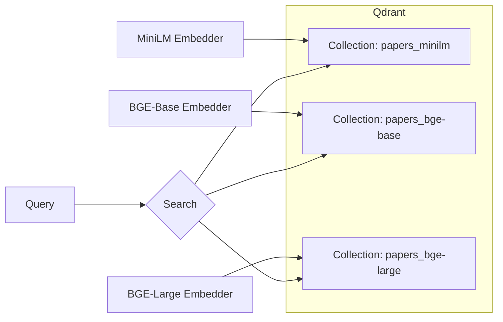
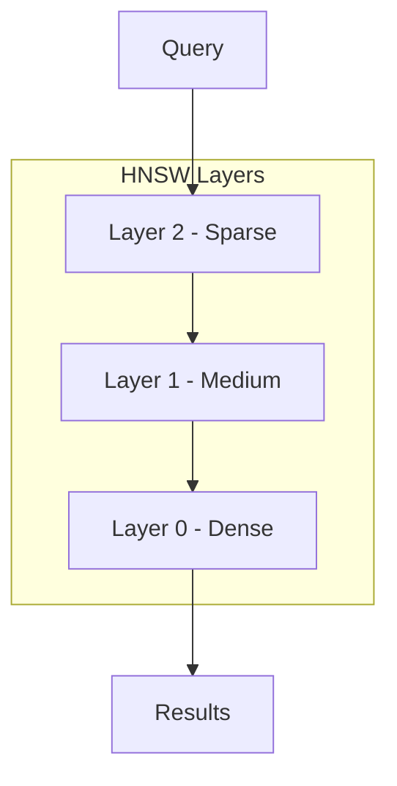

# Vector Storage

How embeddings are stored and searched in Qdrant.

## Qdrant Overview

Qdrant is a vector similarity search engine:

- Written in Rust (fast)
- REST and gRPC APIs
- Filtering support
- Persistent storage
- Easy Docker deployment

## Architecture



Each embedding model gets its own collection (different dimensions).

## Collection Setup

```python
from qdrant_client import QdrantClient
from qdrant_client.models import Distance, VectorParams

class VectorStore:
    def __init__(
        self,
        host: str = "localhost",
        port: int = 6333,
        collection_prefix: str = "papers",
        embedding_model: str = "minilm",
    ):
        self.embedder = get_embedder(embedding_model)
        self.collection_name = f"{collection_prefix}_{self.embedder.name}"
        self.client = QdrantClient(host=host, port=port)
        self._ensure_collection()

    def _ensure_collection(self) -> None:
        collections = [c.name for c in self.client.get_collections().collections]
        if self.collection_name not in collections:
            self.client.create_collection(
                collection_name=self.collection_name,
                vectors_config=VectorParams(
                    size=self.embedder.dimensions,
                    distance=Distance.COSINE,
                ),
            )
```

## Indexing Documents

### Point Structure

Each vector is stored as a "point":

```python
from qdrant_client.models import PointStruct

point = PointStruct(
    id="md5_hash_of_source_page_chunk",
    vector=[0.12, -0.34, ...],  # 768 floats for bge-base
    payload={
        "content": "The transformer architecture...",
        "title": "Attention Is All You Need",
        "authors": "Vaswani et al.",
        "arxiv_id": "1706.03762",
        "arxiv_url": "https://arxiv.org/abs/1706.03762",
        "page": 3,
        "chunk": 0,
    }
)
```

### Batch Upsert

```python
def add_documents(self, documents: list[Document]) -> None:
    texts = [doc.page_content for doc in documents]
    vectors = self.embedder.encode(texts)

    points = [
        PointStruct(
            id=self._generate_id(doc),
            vector=vec,
            payload={"content": doc.page_content, **doc.metadata},
        )
        for doc, vec in zip(documents, vectors)
    ]

    self.client.upsert(
        collection_name=self.collection_name,
        points=points
    )
```

### ID Generation

Deterministic IDs prevent duplicates:

```python
import hashlib

def _generate_id(self, doc: Document) -> str:
    key = f"{doc.metadata['source']}_{doc.metadata['page']}_{doc.metadata['chunk']}"
    return hashlib.md5(key.encode()).hexdigest()
```

## Searching

### Basic Search

```python
def search(self, query: str, k: int = 5) -> list[dict]:
    query_vector = self.embedder.encode_query(query)

    results = self.client.query_points(
        collection_name=self.collection_name,
        query=query_vector,
        limit=k,
    ).points

    return [
        {
            "content": hit.payload.pop("content"),
            "metadata": hit.payload,
            "score": hit.score,
        }
        for hit in results
    ]
```

### With Filtering

```python
from qdrant_client.models import Filter, FieldCondition, MatchValue

# Search only papers from 2024
results = self.client.query_points(
    collection_name=self.collection_name,
    query=query_vector,
    query_filter=Filter(
        must=[
            FieldCondition(
                key="published",
                match=MatchValue(value="2024")
            )
        ]
    ),
    limit=k,
)
```

### Filter Options

| Filter | Example |
|--------|---------|
| Exact match | `MatchValue(value="cs.AI")` |
| Range | `Range(gte=0.5, lte=1.0)` |
| In list | `MatchAny(any=["cs.AI", "cs.CL"])` |
| Text contains | `MatchText(text="transformer")` |

## HNSW Indexing

Qdrant uses HNSW (Hierarchical Navigable Small World) for fast approximate search:



### How It Works

1. Start at top layer (sparse, few connections)
2. Find closest neighbors, descend
3. Repeat until bottom layer
4. Return k nearest neighbors

### Trade-offs

| Parameter | Effect |
|-----------|--------|
| `m` (connections) | Higher = better recall, more memory |
| `ef_construct` | Higher = better index, slower build |
| `ef` (search) | Higher = better recall, slower search |

Default settings work well for most cases.

## Storage Statistics

Check collection stats:

```bash
curl http://localhost:6333/collections/papers_bge-base
```

Response:

```json
{
  "result": {
    "status": "green",
    "vectors_count": 45000,
    "indexed_vectors_count": 45000,
    "points_count": 45000,
    "segments_count": 4,
    "config": {
      "params": {
        "vectors": {
          "size": 768,
          "distance": "Cosine"
        }
      }
    }
  }
}
```

## Operations

### Count Documents

```python
def count(self) -> int:
    return self.client.count(collection_name=self.collection_name).count
```

### Clear Collection

```python
def clear(self) -> None:
    self.client.delete_collection(collection_name=self.collection_name)
    self._ensure_collection()
```

### Delete Specific Points

```python
self.client.delete(
    collection_name=self.collection_name,
    points_selector=PointIdsList(
        points=["id1", "id2"],
    ),
)
```

## Performance Tips

### 1. Batch Operations

```python
# Good: batch upsert
self.client.upsert(collection_name, points=all_points)

# Bad: individual upserts
for point in points:
    self.client.upsert(collection_name, points=[point])
```

### 2. Payload Indexing

Index frequently filtered fields:

```python
self.client.create_payload_index(
    collection_name=self.collection_name,
    field_name="arxiv_id",
    field_schema="keyword"
)
```

### 3. Quantization

Reduce memory with quantization:

```python
from qdrant_client.models import ScalarQuantization, ScalarType

vectors_config=VectorParams(
    size=768,
    distance=Distance.COSINE,
    quantization_config=ScalarQuantization(
        type=ScalarType.INT8,
        always_ram=True
    )
)
```

## Docker Setup

```yaml
services:
  qdrant:
    image: qdrant/qdrant:latest
    ports:
      - "6333:6333"  # REST API
      - "6334:6334"  # gRPC
    volumes:
      - qdrant_data:/qdrant/storage
    environment:
      - QDRANT__SERVICE__GRPC_PORT=6334

volumes:
  qdrant_data:
```

## Monitoring

Qdrant provides a dashboard at `http://localhost:6333/dashboard`:

- Collection statistics
- Vector visualization
- Query testing
- Performance metrics
